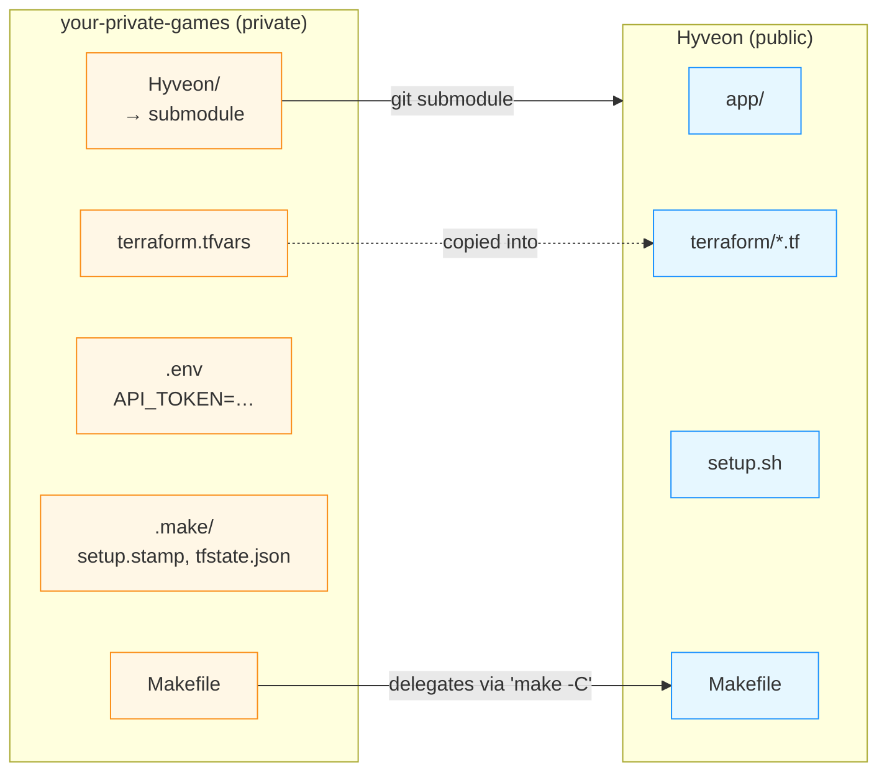

# Private parent repo + submodule

This is the pattern we recommend if you're running the stack for real: a
**private parent repo** you own, with this repo vendored as a git submodule,
plus all the per-deployment secrets sitting alongside. Nothing sensitive ever
lives in a public fork, and pulling upstream changes is one `make update`
away.

If you're just kicking the tyres, the plain
[setup guide](/setup) is fine. Come back to this
page when you're ready to commit your config to source control.

## Why this layout

`terraform.tfvars` (with your hosted zone, and optionally Discord
credentials), `terraform.tfstate` (raw infrastructure state including IAM
role names and the DNS zone ID), and `API_TOKEN` for the management app
are **yours**. None of them belong in this public repo. A submodule keeps
upstream code cleanly separated from your deployment-specific configuration
without forking.



The parent's wrapper Makefile copies `terraform.tfvars` into the submodule on
every plan/apply, then delegates Terraform/dev work to the submodule's own
`Makefile` targets (`tf-plan`, `tf-apply`, `dev`, …). The submodule checkout
stays clean — only files inside its own `.gitignore` get touched.

## Reference layout

```text
your-private-games/                 # private repo you own
├── .gitmodules
├── .gitignore                      # ignores .env, .make/, *.tfstate
├── .env                            # API_TOKEN — gitignored
├── Makefile                        # wrapper — see "What the wrapper does" below
├── terraform.tfvars                # YOUR copy; checked in (private repo)
├── .make/                          # stamp dir (sha of submodule setup.sh, cached tfstate)
└── Hyveon/             # submodule → CoderCoco/Hyveon
```

That's the whole shape. No `config/` directory, no symlinks, no
`docker-compose.override.yml`. Everything driven from one Makefile.

## Quick start (interactive scaffolder)

The public repo ships an interactive TypeScript script that writes the four
files above for you. It only needs Node.js 20+, which you already need for
the rest of the project.

```bash
# 1. Create a private repo on GitHub, then clone it.
git clone git@github.com:you/your-private-games.git
cd your-private-games

# 2. Add the submodule.
git submodule add https://github.com/CoderCoco/Hyveon.git

# 3. Install all deps and run the scaffolder.
(cd Hyveon && npm install)
(cd Hyveon && npm run scripts:init-parent)
```

The script prompts for project name, AWS region, hosted zone, and
(optionally) Discord credentials, then writes `Makefile`,
`terraform.tfvars`, `.env`, and `.gitignore`. Existing files are skipped
unless you pass `--force`.

`init-parent.ts` dispatches on subcommands, with `bootstrap` (the flow
above) implied when none is given:

```bash
init-parent.ts [--force] [--s3-tfvars] [--yes]            Interactive bootstrap (default)
init-parent.ts migrate --to-s3 | --to-local [--yes]        Migrate an existing parent repo's tfvars backend
```

`--s3-tfvars` pre-answers the "bootstrap an S3-backed tfvars store now?"
prompt with yes and writes `.gsd/tfvars-bucket` up front, so `make setup`
provisions the S3 backend on its first run instead of asking interactively.
`--yes` skips confirmation prompts generally (see [`scripts/README.md`](https://github.com/CoderCoco/Hyveon/blob/main/scripts/README.md#flags)
for the exact per-subcommand semantics). Already have a scaffolded parent
repo and want to switch its tfvars backend after the fact instead? See
[Migrating an existing parent repo's tfvars backend](#migrating-an-existing-parent-repos-tfvars-backend)
below.

After it finishes:

```bash
$EDITOR terraform.tfvars            # add at least one entry under game_servers
make setup                          # init submodule, run setup.sh, terraform init
make plan
make apply
```

## What the wrapper Makefile does

The generated wrapper is a thin layer over the submodule's own Makefile.
Eight targets, no surprises:

| Target | What it does |
|---|---|
| `make setup` | One-time bootstrap. Runs `git submodule update --init --recursive`, executes `Hyveon/setup.sh` (installs Node/Terraform/AWS CLI on Debian/Ubuntu, npm-installs all workspaces, builds Lambda bundles, runs `terraform init` and bootstraps the S3 backend), then records the sha256 of `setup.sh` in `.make/setup.stamp`. If `setup.sh` bootstrapped a versioned S3 tfvars backend, `setup` also pulls `terraform.tfvars` down afterwards; on a first bootstrap against an empty bucket the pull can't find anything yet, so it prints a warning suggesting `make tfvars-push` to seed the bucket instead of failing `make setup`. |
| `make plan` | Copies `terraform.tfvars` into `Hyveon/terraform/terraform.tfvars`, then runs `make -C Hyveon tf-plan` — which itself rebuilds the Lambda bundles before `terraform plan`. When an S3 tfvars backend is detected, it auto-pulls the latest tfvars first so a stale local copy can't silently drive the plan; set `NO_PULL=1` to skip the pull for one invocation. |
| `make apply` | Same as `plan`, but delegates to `tf-apply`. The submodule's `tf-apply` recipe prints a post-deploy checklist with the Discord interactions URL when it finishes. When an S3 tfvars backend is detected, it first asserts the local tfvars are still in sync with S3 (via the `tfvars-sync` CLI's `check` subcommand), refusing to apply against drifted vars; set `FORCE_APPLY=1` to skip the check for one invocation. |
| `make update` | Bumps the submodule to the tip of `main` (`git submodule update --remote --merge`). If the new `setup.sh` differs from the recorded sha, clears `.terraform/` and re-runs `setup.sh` automatically; otherwise leaves it alone. Reminds you to commit the new submodule pointer. |
| `make dev` | Pulls live tfstate into `.make/tfstate.json` (so ConfigService can read it via `TF_STATE_PATH`), wipes stale TS build info under the submodule's `app/packages/*/`, then runs `make -C Hyveon dev`, exporting `API_TOKEN` and `TF_STATE_PATH` to the child make. |
| `make tfvars-pull` | Pulls `terraform.tfvars` from the configured S3 backend (requires one to be detected — see below). Refuses to run if the local file has uncommitted git changes, so a pull can never silently discard edits you haven't committed. |
| `make tfvars-push` | Pushes the local `terraform.tfvars` to the configured S3 backend (requires one to be detected). |
| `make tfvars-diff` | Prints a unified diff between the local and remote `terraform.tfvars` (requires a backend to be detected). |

The `tfvars` copy is **always fresh** on plan/apply — the recipe `cp`s
unconditionally, not just when the file is older than the destination. This
prevents stale variables from sneaking into a deploy when you've edited the
parent's `terraform.tfvars` between runs.

## S3 tfvars backend detection

The three `tfvars-*` targets, and the automatic gating baked into
`setup`/`plan`/`apply` above, all key off the same `TFVARS_BACKEND`
resolution in the generated Makefile:

- `GSD_TFVARS_BACKEND=s3` forces S3 mode, even if the marker file below is
  missing.
- `GSD_TFVARS_BACKEND=local` forces local-file mode, even if a marker file
  is present.
- Otherwise: S3 if either marker file exists — the **parent-root**
  `.gsd/tfvars-bucket` (written by `bootstrap --s3-tfvars` or
  `migrate --to-s3`) or the **submodule-local**
  `Hyveon/.gsd/tfvars-bucket` (written by `setup.sh`'s
  `bootstrap_tfvars_backend()`) — local otherwise.

`GSD_TFVARS_BUCKET`, if set, wins over both marker files' contents when the
wrapper needs to display or pass along the bucket name. Otherwise it reads
the parent-root marker first, falling back to the submodule-local marker if
the parent-root one doesn't exist — see [Parent-root marker takes
precedence](#parent-root-marker-takes-precedence) below for why.

`make tfvars-pull`, `make tfvars-push`, and `make tfvars-diff` fail fast
with a pointer to `GSD_TFVARS_BACKEND`/`setup.sh` when no backend is
detected — they're operator-driven, so they never silently no-op.

The gates inside `setup`/`plan`/`apply` behave differently: in **local
mode** (no marker file and `GSD_TFVARS_BACKEND` isn't `s3`) they're silent
no-ops, so `make setup`, `make plan`, and `make apply` behave exactly as
they did before S3 tfvars sync existed. Nothing changes for a single-file,
no-remote-backend deployment.

## Migrating an existing parent repo's tfvars backend

Started out on a local `terraform.tfvars` (or bootstrapped an S3 backend and
want to drop it) and want to switch after the fact, without re-running the
whole interactive scaffolder? `init-parent.ts migrate` rewires an
already-scaffolded parent repo (one where `bootstrap` has already run and a
`Makefile` exists) in place. Run it the same way as `bootstrap`, but from an
existing parent repo checkout:

```bash
npx --prefix Hyveon/scripts tsx Hyveon/scripts/init-parent.ts migrate --to-s3
# or
npx --prefix Hyveon/scripts tsx Hyveon/scripts/init-parent.ts migrate --to-local
```

Exactly one of `--to-s3` / `--to-local` is required. Both directions prompt
for confirmation before touching anything — pass `--yes` to skip the prompt
(e.g. for scripting/CI).

**`migrate --to-s3`** — moves a local-only parent repo onto a versioned S3
backend:

1. Reads `project_name` out of the parent repo's existing `terraform.tfvars`
   and derives the bucket name `${project_name}-tfvars` — the same naming
   `bootstrap --s3-tfvars` uses.
2. Writes the `.gsd/tfvars-bucket` marker at the parent repo root.
3. Rewrites the `Makefile` with the S3-aware targets (identical output to a
   fresh `bootstrap` render — the Makefile is always S3-aware; only the
   marker's presence flips `TFVARS_BACKEND` to `s3`).
4. Runs `make setup` with `GSD_TFVARS_BACKEND=s3` so `terraform/bootstrap/`
   provisions the bucket.

`terraform.tfvars` itself is never read for anything beyond `project_name`,
nor written by the migration — pull the now-remote copy down explicitly with
`make tfvars-pull` if you want confirmation it round-tripped through S3 (or
push it up with `make tfvars-push` if the bucket comes back empty).

**`migrate --to-local`** — the reverse: drops an S3 backend and reverts to
reading `terraform.tfvars` straight off disk:

1. Resolves the target bucket the same way the generated Makefile's
   `TFVARS_BUCKET` does — `GSD_TFVARS_BUCKET` env var wins if set, otherwise
   the parent-root `.gsd/tfvars-bucket` marker, otherwise the submodule-local
   one written by `setup.sh`. Exits `1` with no changes if none resolve
   (already local, nothing to migrate).
2. Pulls `terraform.tfvars` down from S3 first if it's missing locally — a
   parent repo that migrated to S3 a while ago may have no local copy at
   all.
3. Diffs the local file against the remote object byte-for-byte (the same
   comparison `make tfvars-diff` / `tfvars-sync.ts diff` uses) and **aborts,
   leaving every file untouched**, if they've drifted — reconcile with
   `make tfvars-pull` or `make tfvars-push` first, then re-run the
   migration. If `s3://<bucket>/terraform.tfvars` doesn't exist at all (the
   bucket was created but never seeded), this comparison is skipped
   entirely — there's nothing remote to reconcile against, so migration
   proceeds straight to deleting the markers in step 4.
4. On a clean match (or when the remote object was never seeded), deletes
   both the parent-root and submodule-local `.gsd/tfvars-bucket` markers and
   the `terraform.tfvars.lock` sidecar. `terraform.tfvars` itself is left in
   place — it's already the correct source of truth for local mode once the
   markers are gone.

`migrate --to-local` **never deletes the S3 bucket** — it only removes the
markers that make the parent repo look at it. Tear the bucket down yourself
once you're done with it:

```bash
terraform -chdir=Hyveon/terraform/bootstrap destroy
```

### Parent-root marker takes precedence

Both migration directions, the generated Makefile's `TFVARS_BACKEND`/
`TFVARS_BUCKET` resolution, and `setup.sh`'s post-bootstrap pull all agree on
the same precedence when both marker files could theoretically exist: the
**parent-root** marker (`<parent>/.gsd/tfvars-bucket`, written by
`bootstrap --s3-tfvars` or `migrate --to-s3` before `setup.sh` ever runs)
always wins over the **submodule-local** marker (`<parent>/Hyveon/.gsd/tfvars-bucket`,
written by `setup.sh`'s own `bootstrap_tfvars_backend()`). An explicit
parent-root marker reflects a deliberate operator choice, so it takes
priority even before `setup.sh` gets a chance to write its own submodule-local
marker. `GSD_TFVARS_BACKEND=s3|local` overrides both markers entirely when
set.

## Submodule update with idempotent setup.sh re-run

`make update` records `sha256sum Hyveon/setup.sh` in
`.make/setup.stamp` after each successful setup. On every subsequent
`update`, it compares the new file's sha against the stamp:

- **Unchanged** → nothing to do; the existing `.terraform/` and installed
  npm dependencies are still valid.
- **Changed** → upstream tweaked the bootstrap (new tool version, S3 backend
  config change, Lambda build step, …). The recipe wipes
  `Hyveon/terraform/.terraform/` and re-runs `setup.sh`, then
  records the new sha.

You don't have to remember whether the bootstrap moved. The stamp file is
cheap and gitignored.

## .env and the API_TOKEN

`API_TOKEN` is the bearer token the management app's Nest server requires
on every `/api/*` request. The wrapper Makefile loads it from `.env` via
`include`, so it's available for `make dev` and any docker-compose target
without ever being baked into the Makefile itself:

```makefile
ifneq (,$(wildcard $(REPO_ROOT)/.env))
include $(REPO_ROOT)/.env
export
endif
```

`.env` is in the parent's `.gitignore`. Generate a fresh token with
`openssl rand -hex 32` (or just re-run `init-parent.ts`) — there's no need
to keep the same token across rebuilds.

## tfstate lives in S3 by default

`Hyveon/setup.sh` provisions an S3 bucket
(`{project_name}-tf-state`) and a DynamoDB lock table
(`{project_name}-tf-locks`) on first run, then `terraform init`s with the
S3 backend pointing at them. The parent repo never holds `terraform.tfstate`
on disk — the wrapper's `make dev` pulls a fresh copy into
`.make/tfstate.json` for the management app to read.

If you don't want a remote backend (single-operator, throwaway deployment),
delete the S3 bootstrap from your fork of `setup.sh`. We don't recommend
this for anything you care about.

## Discord credentials: pick a home

There are three reasonable places for the Application ID, Bot Token, and
Public Key. Trade-offs:

| Location | Pros | Cons |
|---|---|---|
| **tfvars in the private parent** | One source of truth; `terraform apply` seeds them. Rotation via `terraform taint`. | They're on disk wherever the parent repo is cloned. |
| **Environment at apply time** (`TF_VAR_discord_bot_token=…`) | Never on disk. | Every operator needs the token in their shell to apply. |
| **Dashboard only** | Token only exists in Secrets Manager. | You have to paste it once per fresh environment, and the DDB `CONFIG#discord` row is seeded manually. |

The tfvars route is what most people pick, and it's what `init-parent.ts`
will offer to seed. Your parent repo is private, so it ends up covered by
the same "private-repo trust boundary" as everything else.

Rotation after the first apply (tfvars route):

```bash
terraform taint aws_secretsmanager_secret_version.discord_bot_token
# or: aws_secretsmanager_secret_version.discord_public_key
# or: aws_dynamodb_table_item.discord_config_seed
make apply
```

## Keeping up with upstream

```bash
make update
git add Hyveon
git commit -m "chore: bump Hyveon to $(git -C Hyveon rev-parse --short HEAD)"
make plan        # eyeball the diff
make apply       # if it looks right
```

`make update` always reminds you about the commit step at the end. If
`setup.sh` changed upstream, it'll have already re-run by the time `make
plan` starts, so the next plan picks up any new tooling cleanly.

Things that tend to need attention after a bump:

- New or renamed Terraform variables → add them to your
  `terraform.tfvars`. Compare against
  `Hyveon/terraform/terraform.tfvars.example`.
- New environment variables on the Lambdas → typically Terraform handles
  this automatically, but verify in the plan output.
- Changes to the four slash-command descriptors → re-click **Register
  commands** in the dashboard so Discord picks them up per guild.

## CI in the parent repo (optional)

A useful GitHub Actions pattern if you want automated drift detection:

```yaml
# .github/workflows/plan.yml in the parent repo
name: terraform plan
on:
  pull_request:
  schedule:
    - cron: "0 9 * * 1"       # Monday 09:00 UTC drift check

jobs:
  plan:
    runs-on: ubuntu-latest
    steps:
      - uses: actions/checkout@v4
        with:
          submodules: recursive
      - uses: aws-actions/configure-aws-credentials@v4
        with:
          role-to-assume: ${{ secrets.AWS_ROLE_ARN }}
          aws-region: us-east-1
      - uses: hashicorp/setup-terraform@v3
      - uses: actions/setup-node@v4
        with:
          node-version: 20
      - run: make setup
      - run: make plan
```

Use OIDC → an IAM role for `aws-actions/configure-aws-credentials` rather
than stashing long-lived keys. The role's policy is the same
`GameServerDeployAll` inline policy from the [setup guide](/setup).

## What NOT to do

- **Don't fork the public repo and edit it.** The submodule pattern gives
  you every pinning benefit of a fork without the merge conflicts. If you
  need a real code change, contribute upstream and `make update` to bump
  to the new commit.
- **Don't commit `terraform.tfvars` inside the submodule.** Even a private
  parent doesn't save you if someone later runs `git submodule foreach git
  push origin HEAD`. Keep your tfvars in the *parent* — the wrapper copies
  it into the submodule at apply time, and the submodule's own
  `.gitignore` excludes `terraform/*.tfvars`.
- **Don't hardcode `API_TOKEN` in the wrapper Makefile.** Use `.env` and
  the `include`/`export` pattern. The Makefile lives in your private repo,
  but a leaked clone is one careless `git push` away.
- **Don't run plan/apply directly in the submodule.** Always go through
  the parent's `make plan`/`make apply` so the freshly-edited
  `terraform.tfvars` is copied in first. A plan against stale vars is a
  plan against the wrong universe.

## Troubleshooting

| Symptom | Cause | Fix |
|---|---|---|
| `make plan` says "No such file or directory" pointing at `Hyveon/` | Submodule wasn't initialised | `make setup` (or `git submodule update --init --recursive`). |
| `make apply` runs against an old `terraform.tfvars` | You edited the parent's tfvars but ran terraform inside the submodule directly | Always run `make apply` from the parent — the `copy-tfvars` recipe forces a fresh copy. |
| `make update` silently pulls main and breaks apply | Upstream changed something incompatible | The stamp file's job is to flag setup.sh changes; for non-bootstrap breakage, run `make plan` and read the diff. Pin to a SHA in `.gitmodules` if you want stricter control. |
| After bumping upstream, Discord commands have wrong arguments | Descriptors in `@hyveon/shared/commands.ts` changed | Click **Register commands** for each guild in the dashboard. |
| `make dev` complains it can't read tfstate | First-time run before `make apply` | Ignore — the recipe writes `null` and the app degrades gracefully until the first apply succeeds. |
| CI plan shows a Lambda recreating every run | Bundle hash changes between builds | Run `npm ci` (not `npm install`) in CI to pin dependencies; `setup.sh` already does this. |
